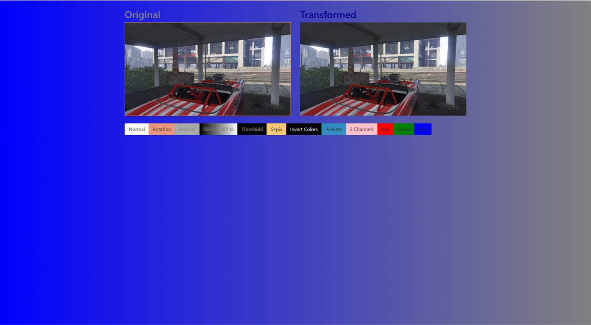

# Efecte Video

Demo: https://acovalcic.github.io/EfecteVideo/

Aplicatie ce permite aplicarea de efecte vizuale asupra unui clip video, precum: Rotire, Reliefare, Sepia, Pixelare si altele.

## Interfata aplicatiei:

## Prezentarea efectelor:

### Normal 

### Rotire 

### Reliefare (Emboss)

### Tonuri de gri

### Alb & Negru (Threshold)

### Sepia

### Inversarea culorilor

### Pixelare

### 2 Canale

### Rosu

### Verde

### Albastru

